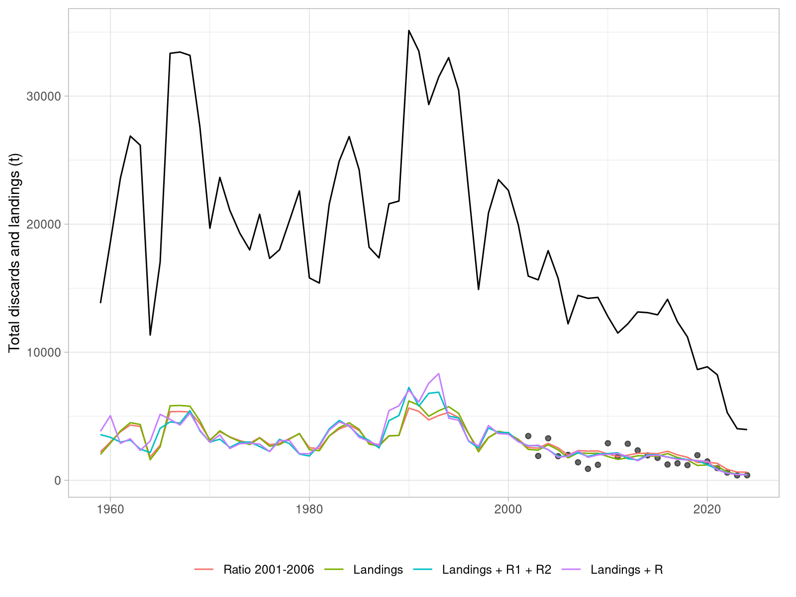

```{r, knitr, include=FALSE}
knitr::opts_chunk$set(cache=FALSE, out.width="65%", fig.align="center",
  echo=FALSE, warning=FALSE, message=FALSE)
```

## Discards reconstruction for sol.27.4

- Previous assessment (AAP, Aarts & Poos, 2009) estimated discards prior to 2002
- Discards part of the system equation
- Separated landings & discards fleet in SS3 to apply different wtatage
- Makes discards reconstruction not possible in SS3
- Reconstruction outside of assessment model to evaluiate impact
- *Reconstruct discards back in time for the period prior to 2002, where estimates are lacking.* WGNSSK, 2024.

## Data - Available landings and discards

```{r}
include_graphics("report/discards_landings.png")
```

## Data - Discards proportions

```{r, out.width="45%", fig.show='hold'}
include_graphics(c("report/discards_prop_catch.png",
  "report/discards_prop.png"))
```

## Methods - discard ratio

- Compute average discards to landings ratio, 2002-2006
- Apply to landings 1959-2001 to compute discards

## Methods - GLM

$$
\begin{aligned}
&\text{Discards}_i \sim \text{Gamma}(\mu_i, \theta) \\
&\log(\mu_i) = \beta_0 + \beta_1 \log(\text{Landings}_i) + \beta_2 \log(\text{Rec}_{i-1}) + \beta_3 \log(\text{Rec}_{i-2})
\end{aligned}
$$

```{r, eval=FALSE, echo=TRUE}
mod12 <- glm(discards ~ log(landings) + log(rec1) + log(rec2),
  family = Gamma(link = "log"))
```


- `discards ~ landings`
- `discards ~ landings + R12`
- `discards ~ landings + R`

## Diagnostics

```{r, out.width="35%", fig.show='hold'}
include_graphics(c("report/landings_model_diagnostics.png", 
  "report/landingsrec_model_diagnostics.png"))
```

| Model                 | DF | AIC   | BIC   |
|-----------------------|----|-------|-------|
| Landings              | 3  | 357.9 | 361.3 |
| Landings + Rec1 + Rec2 | 5  | 357.2 | 362.9 |
| **Landings + Rec**       | 4  | 353.8 | 358.4 |

## Results - Discards predictions

```{r}
include_graphics("report/discards_predictions.png")
```

## Results - Discards predictions + landings

```{r}

```

## Results - SSB and F

```{r, out.width="45%", fig.show='hold'}
include_graphics(c("report/SSBs.png", "report/Fbars.png"))
```

## Results - SSB and F compared to WGNSSK

```{r}
include_graphics("report/SSBs_compare.png")
```

## Results - reference points

|Reference point |  WGNSSK*|  Landings| Landings + R| Ratio 2001-2006|
|:---------------|--------:|---------:|------------:|---------------:|
|$MSYB_{trigger}$|    49265|     54476|        54696|           54316|
|$F_{MSY}$       |     0.19|     0.217|        0.214|           0.215|
|$B_{lim}$       |    35453|     39203|        39362|           39089|

*WGNSSK refers to the recomputed values using the 1957:2024 dataset.

## Results - SSB trajectories and reference points

```{r}
include_graphics("report/SSBs_refpts.png")
```

## Results - discards predictions including AAP (2021)

```{r}
include_graphics("report/discards_predictions_aap.png")
```

