```{r, knitr, echo=FALSE, message=FALSE}
library(knitr)
opts_chunk$set(echo=FALSE, message=FALSE, warning=FALSE,
  out.width="75%", fig.pos='htb', fig.align="center")
```

# Introduction

Discard data for North Sea sole are only available from 2002 onwards, leaving earlier periods without direct observations. Historically, discards have constituted a significant component of the fishery, indicating that a substantial portion of total catch was not landed. The current Stock Synthesis 3 (SS3) model treats landings and discards as separate fleets in order to apply different weight-at-age assumptions, which prevents reconstruction of discards internally within the model framework. In the past, discards were reconstructed by AAP by explicitly incorporating the discard process into the population dynamics model, enabling estimation of total removals over time.

The WGNSSK has expressed interest in improving the catch series by adding the reconstruction of the pre-2001 discard time series. This work therefore explores a number of methods to carry out that process, and evaluates the potential effects for stock assessment outcomes, including stock status, as well as for stock productivity and associated biological reference points.

# Material and Methods

## Data
Annual total landings and discards are taken from the WGNSSK 2025 stock assessment dataset: the former for the 1957-2024 period, and the later starting in 2002. Estimated recruitment series, to be used as a covariate, are taken from the Stock Synthesis 2025 WGNSSK stock assessment for sol.27.4.

Landings and discards have followed a similar trend over the 2002-2024 period, with greater variability in discards (Figure \@ref(fig:discardslandings)), for example the low values of the 2005-2009 period. The proportion of total catch that is discarded has also varied over time, with an apparent cycle and a stable value in recent years after the 2018 cohort (Figure \@ref(fig:discardspropcatch)). The proportion of discards corresponding to ages 1 and 2 has fluctuated over time, and does not appear to be clearly influenced by the total amount of discards (Figure \@ref(fig:discardsprop)).

```{r discardslandings, fig.cap="Total discards and landings (in weight)."}
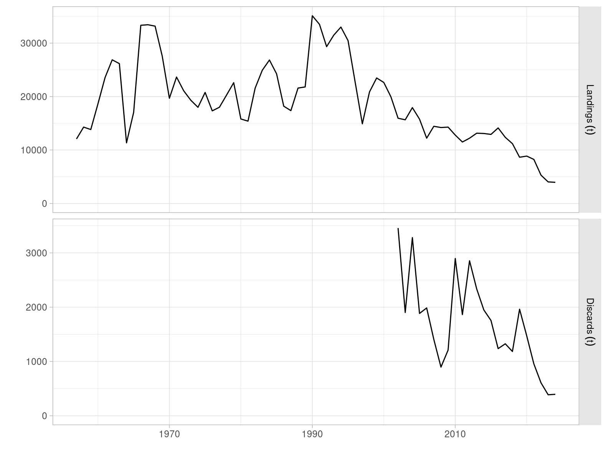
```

```{r discardspropcatch, fig.cap="Proportion of total catch discarded for the 2002-2024 period"}
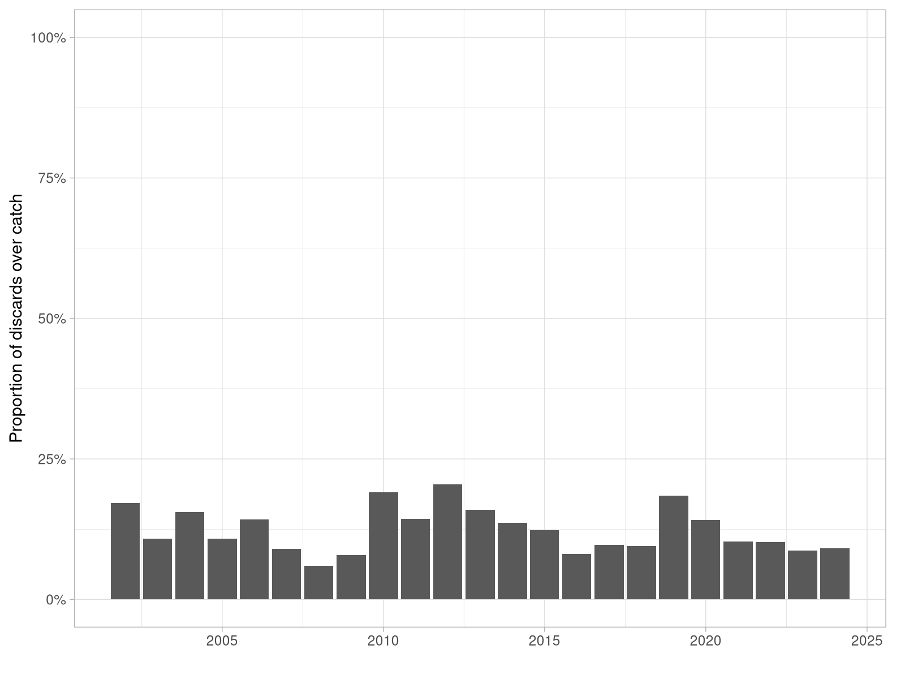
```

```{r discardsprop, fig.cap="Proportion of total estimated discards that correspond to ages 1 and 2 for the 2002-2024 period. The black line shows the relative trend in total discards."}
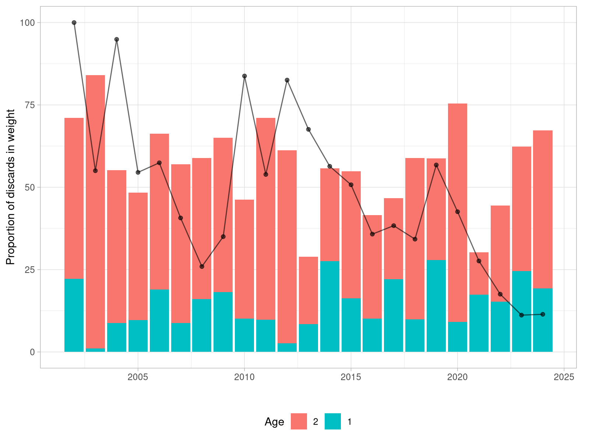
```

```{r resultsdiscardsratio, fig.cap=""}
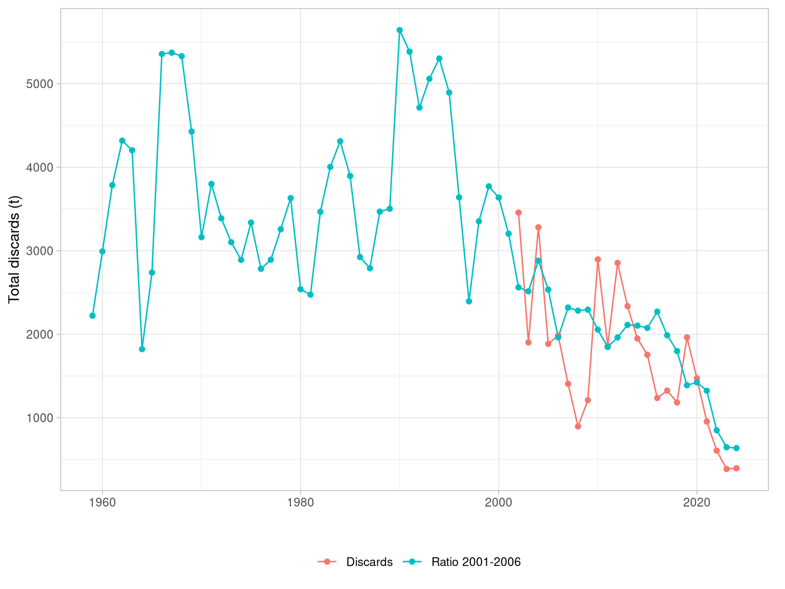
```

## Average discards to landings ratio

The simples approach to reconstruct discards is to assume that they are a constant proportion of landings, and to use the average ratio of discards to landings observed in some relevant period to reconstruct discards for prior to 2001. This approach assumes that discards are only influenced by the amount of catch. The 2002-2006 average ratio of discards to landings (16.1 %) was used to reconstruct discards for previous years.

## Modelling total discards over landings and abundance of ages 1 and 2 fish

The relationship between discards and landings was modeled using a generalized linear model (GLM) with a Gamma error distribution and a log link function. This distributional totalchoice is appropriate for strictly positive, right-skewed response variables such as discard quantities, and the log link ensures positive fitted values while allowing multiplicative effects of predictors (Zuur *et al*, 2007).

Discards were first modeled as a function of the natural logarithm of landings:

$$
\begin{aligned}
&\text{Discards}_i \sim \text{Gamma}(\mu_i, \theta) \\
&\log(\mu_i) = \beta_0 + \beta_1 \log(\text{Landings}_i)
\end{aligned}
$$

This formulation implies that proportional changes in landings are associated with proportional changes in expected discards.

To evaluate whether the strength of recruitment can provide additional explanatory power, we extended the initial model by including the log of recruitment as a covariate. Stronger cohorts distribute more widely at younger ages, due to competition, so discard ratios could increase for one or two years after a large recruitment event. The effect of recruitment was introduced with the corresponding lags of one (Rec1) and two years (Rec2)

$$
\begin{aligned}
&\text{Discards}_i \sim \text{Gamma}(\mu_i, \theta) \\
&\log(\mu_i) = \beta_0 + \beta_1 \log(\text{Landings}_i) + \beta_2 \log(\text{Rec1}_i) + \beta_3 \log(\text{Rec2}_i)
\end{aligned}
$$

A combined recruitment index was also used, with the sum of estimated numbers at age for age 0 in the previous and two years before (Rec). The potential effect of each age on potential discards is not separated in this model by pooling them into a single value of potential availability of undersize fish.

$$
\begin{aligned}
&\text{Discards}_i \sim \text{Gamma}(\mu_i, \theta) \\
&\log(\mu_i) = \beta_0 + \beta_1 \log(\text{Landings}_i) + \beta_2 \log(\text{Rec}_i)
\end{aligned}
$$

All analyses were conducted in R using the glm function from base R (R Core Team, 2024).

## Effect on stock assessment and reference points

The Stock synthesis model employed in WGNSSK 2025 has been rerun with three of the different discard reconstructions, those using the average ratio, the GLM based on landings, and obne based on landings and age 1 and 2 recruits. The reconstructed values from 1959 to 2001 were assigned as total catch and bycatch for the discards fleet (4) in the SS3 model data file. The models employing recruits with 1 and 2 year lags provided predictions from 1959 only, so the same time frame was employed for the discards ratio method. The eqsim-based algorithm used to compute reference points during the benchmark was rerun for these three assessment results. The assessment results from last year were also used to recalculate the reference points, to use it as a base case with the same length of data as the others.

# Results

## Model diagnostics

The three GLM models show very similar AIC and BIC values, although slightly lower for the one using the combined recruitment values (Table 1). The ANOVA comparison appeasrs significant for the model using overl recruitment index (F=6.15, p = 0.022), but not for the model using the separate recruitment indices (F=2.13, p = 0.15).

Table 1: Model comparison based on AIC values for the three GLM models fitted to the observed discards series. The model with the lowest AIC is highlighted in bold.

| Model                 | DF | AIC   | BIC   |
|-----------------------|----|-------|-------|
| Landings              | 3  | 357.9 | 361.3 |
| Landings + Rec1 + Rec2 | 5  | 357.2 | 362.9 |
| **Landings + Rec**       | 4  | 353.8 | 358.4 |

Diagnostic plots for the three models are presented in Figures \@ref(fig:landingsmodeldiagnostics), \@ref(fig:landingsrec12modeldiagnostics) and \@ref(fig:landingsrecmodeldiagnostics). All three fits present some trends in the residuals in time, with alternating periods of larger and smaller residuals, which could be indicative of shifts in the fishery. The choice of the gamma distribution could be further evaluated, but it appears to be appropriate for the data.

```{r landingsmodeldiagnostics, fig.cap="Diagnostic plots for the GLM model with landings as the only predictor."}
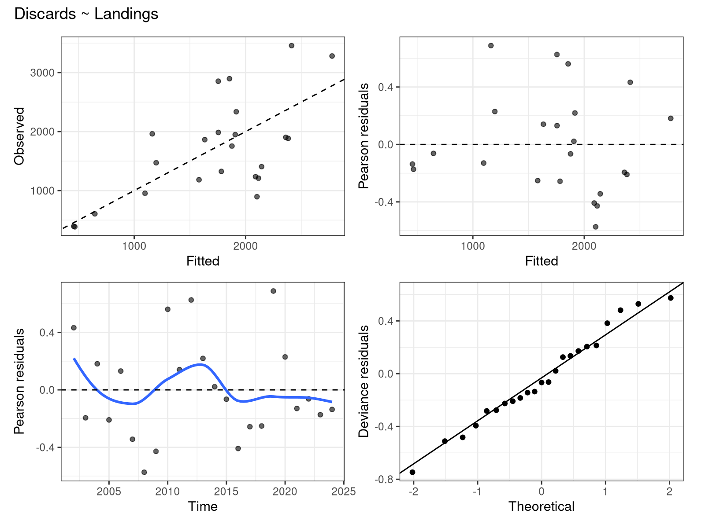
```

```{r landingsrec12modeldiagnostics, fig.cap="Diagnostic plots for the GLM model with landings and separate recruitment indices as predictors."}
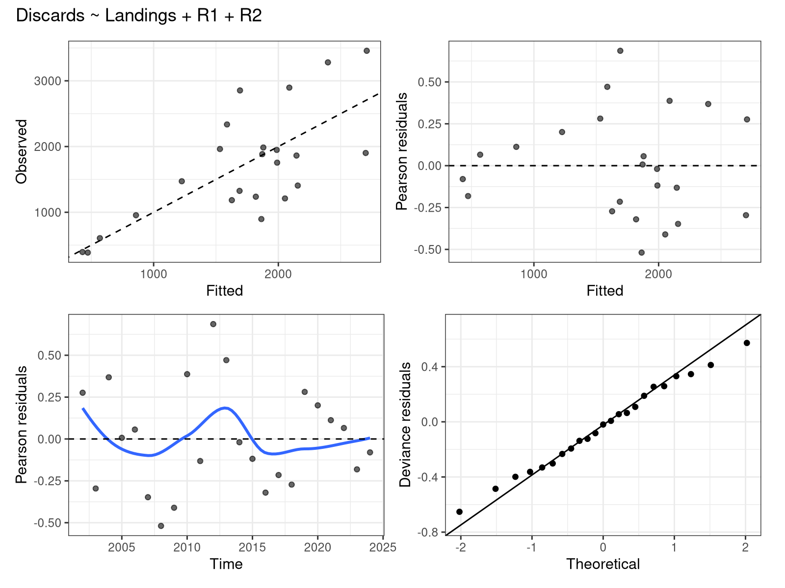
```

```{r landingsrecmodeldiagnostics, fig.cap="Diagnostic plots for the GLM model with landings and combined recruitment index as predictors."}
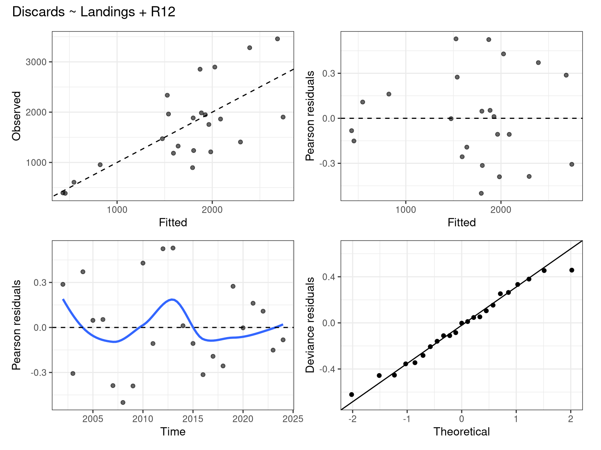
```

## Model predictions

Predictions, or more correctly calculations for the method based on the average ratio, are presented in Figure \@ref(fig:discardspredictions). All options predict discards are large values prior to 2001, consistent with expectations. All models using recruitment as covariate predict very large discard values in the 1978-1982 period, higher than when employing only landings as predictor. Recruitment appears to be linked but only explains a relatively reduced part of the total variance.

```{r discardspredictions, fig.cap="Predicted total discards (in weight) from the different models fitted to the observed discards series. The dots show the observed discards."}
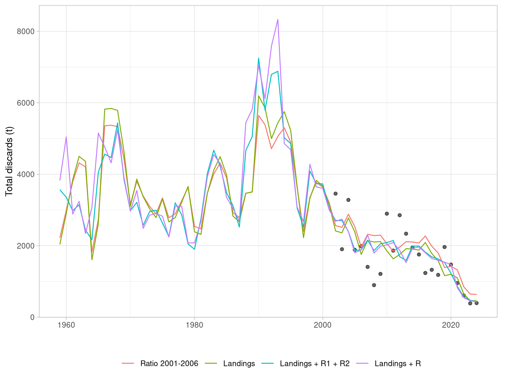
```

\FloatBarrier

## Effect on stock assessment and reference points

The Stock Synthesis 3 model runs with the different discard reconstructions show similar trajectories for spawning stock biomass (SSB) and fishing mortality (Fbar), with some differences in the earlier years of the time series (Figures \@ref(fig:ssbs) and \@ref(fig:fbars)). The runs with the GLM-based reconstructions, particularly the one including recruitment, show higher SSB values in the earlier years compared to the run using the average ratio, which is consistent with the higher discard estimates predicted by those models. The WGNSSK 2025 run, which does not include reconstructed discards, shows lower SSB values in the earlier years, as expected.

```{r, ssbs, fig.cap="Spawning stock biomass (SSB) trajectories for the different discard reconstruction methods and the WGNSSK 2025 run."}
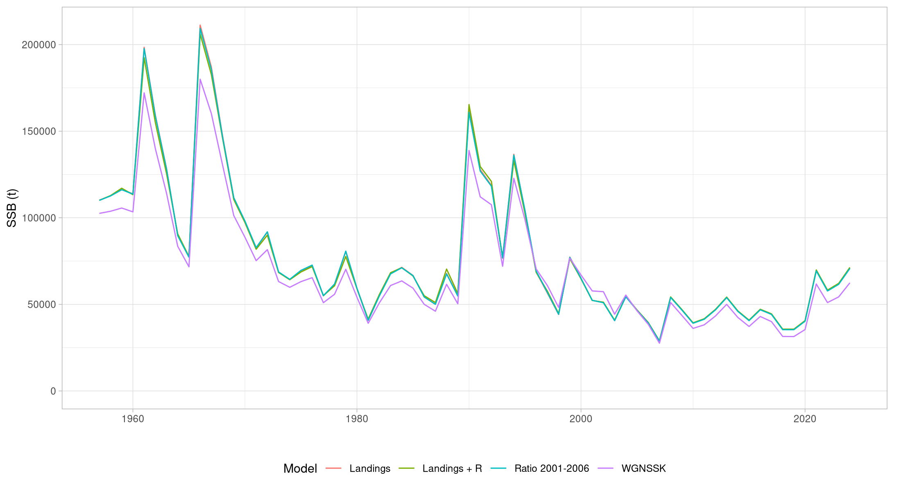
```

```{r, fbars, fig.cap="Fishing mortality trajectories for the different discard reconstruction methods and the WGNSSK 2025 run."}
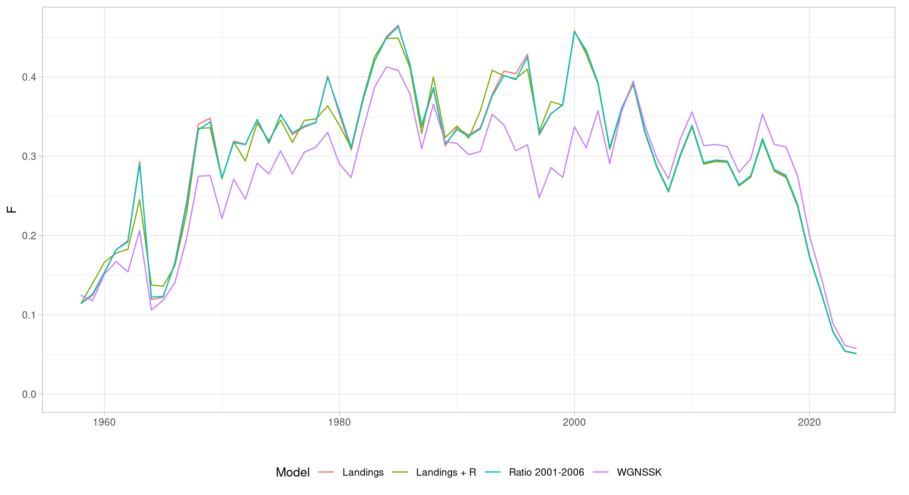
```

Differences in estimated the trajectories can be observed by comparing the trasjectories to that of the current WGNSSK model. Figure \@ref(fig:ssbfcompare) plots the ratios of SSB and F of the three methods (mean ratio, landings and landings + recruitment) over the WGNSSk time series. No appreciable differences were detected in the fits to catch and indices.

```{r ssbfcompare, fig.cap="Time series of estimated SSB and F for the three methods as ratios over those obtained by the WGNSSK 2025 stock assessment model."}
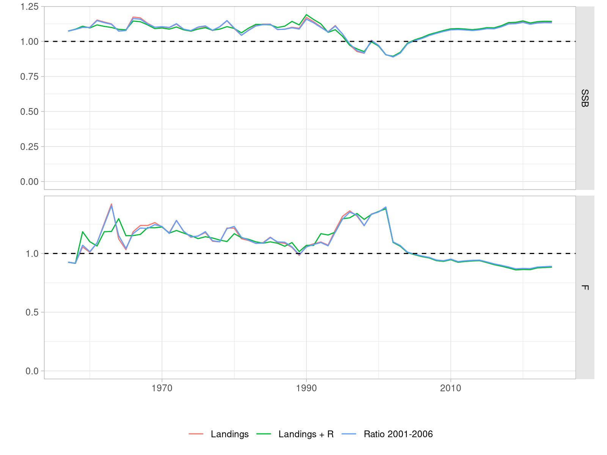
```

Reference points recomputed for each time series are shown on Table 2. As expected, the additional catches early in the series led to higher biomass reference points, with $MSYB_{trigger}$ settling at around 54,500 t. Figure \@ref(fig:ssbsrefpts) presents the estimated SSB series for each assessment model run with the corresponding biomass reference points.

Table 2: Main reference points as computed from assessment runs with the different discards time series {#tbl:refpts}

|Reference point |   WGNSSK|  Landings| Landings + R| Ratio 2001-2006|
|:---------------|--------:|---------:|------------:|---------------:|
|$MSYB_{trigger}$|    49265|     54476|        54696|           54316|
|$F_{MSY}$       |     0.19|     0.217|        0.214|           0.215|
|$B_{lim}$       |    35453|     39203|        39362|           39089|

```{r ssbsrefpts, fig.cap="SSB trajectories for the different discard reconstruction methods and the WGNSSK 2025 run, with the $MSYB_{trigger}$ (hash line) and $B_{lim}$ (dotted line) reference points indicated."}
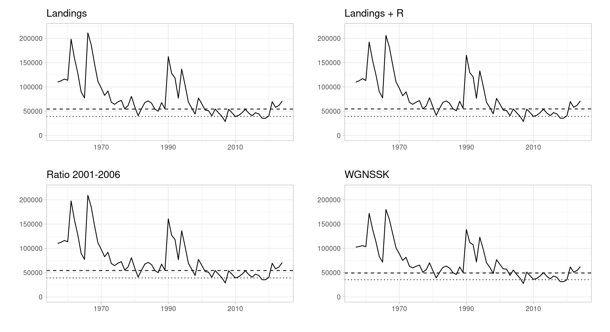
```

A final comparison of these methods can be made with the discards time series reconstructed by the AAP (Aarts & Poos) model that was previously applied to this stock, in this case the WGNSSK 2021 run. The inputs provided to AAP and SS3 are not exactly the same, specially the different indices of  abundance. AAP was fitted to a simpler GAM-standardized BTS index, with no time-varying spatial component, and the conventional SNS densities. The AAP predicted discards prior to 2002 are generally lower in most years (Figure \@ref(fig:discardspredictionsaap)) but more similar in years with high values.

```{r discardspredictionsaap, fig.cap="Predictions of total discards from the various methods, including those obtained by the WGNSSK 233021 run of AAP."}
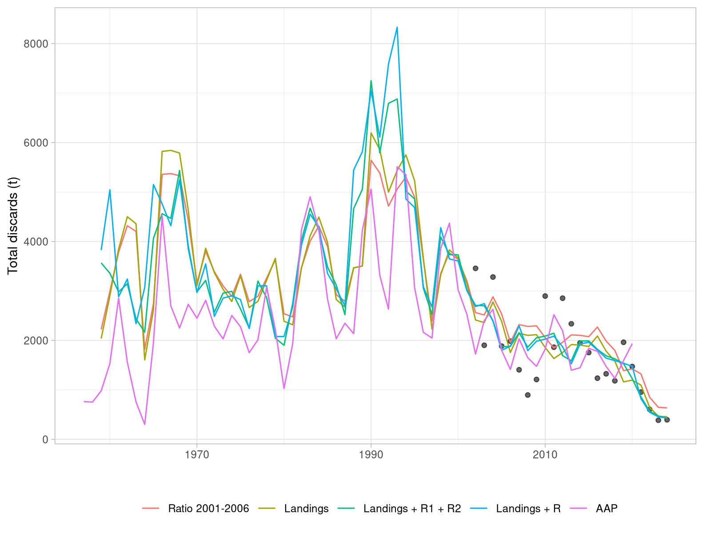
```

# Discussion

Somne approaches to reconstruct the time series of total discards for North Sea sole prior to 2001 were explored, and their potential effects on stock assessment outcomes and reference points were evaluated. The results suggest that the amount of landings is by far the strongest predictor of the amount of discards, and that including recruitment as a covariate can provide some additional explanatory power, although it does not appear to be a major driver of the variance in annual discards. 

The additional catches introduced by the reconstructed discard series lead to larger biomass being estimated in the period until 2001, and consequently to higher biomass reference points. These differences, however, are not very large, and the overall trajectories of SSB and F are similar across the different methods for reconstructing discards.

In contrast with the methodology used by the AAP model, by incorporating discards explicitely in the system equation, these approaches do not fully integrate into the assessment model. Variance related to this process is also left out of the assessment model calculations. Integrating this step into the assessment model would be the preferable approach to consider in a future benchmark.

# References

R Core Team (2024). R: A language and environment for statistical computing. R Foundation for Statistical Computing.

Zuur, A. F., Ieno, E. N., & Smith, G. M. (2007). Analysing Ecological Data. Springer.
