```{r, knitr, include=FALSE}
knitr::opts_chunk$set(cache=FALSE, out.width="65%", fig.align="center", fig.path="report",
  echo=FALSE, warning=FALSE, message=FALSE)
```

## Problems with current setup

- Current flexibility uses random walks for all fleets, landings changing on time
- Set to a constant value from a given age
- Landings selectivity freely estimated in time
- Final years commonly showing drops in selectivity at age 3-4
- Number of parameters too high

## Changes to selectivity setup

- Random walk per year, fixed from age 5
- Moved to functional forms for all fleets
- Fix a few poorly-estimated parameters
- **Landings**, Logistic
- **BTS** Double normal
  - p4 (descending width), p6 (final), avoid drop at older ages
  - Allowed to vary on pulse years, 2009-2021
- **COAST** Double normal
  - p1 (peak) fixed at ~0
- **Discards** Double normal

## Estimated selectivities

:::: {.columns}
::: {.column width="50%"}
- WGNSSK
```{r, out.width="100%"}
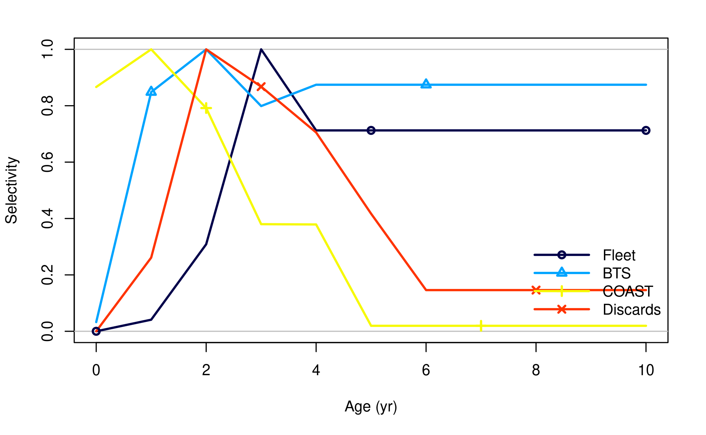
```
:::
::: {.column width="50%"}
- SELEX
```{r, out.width="100%"}
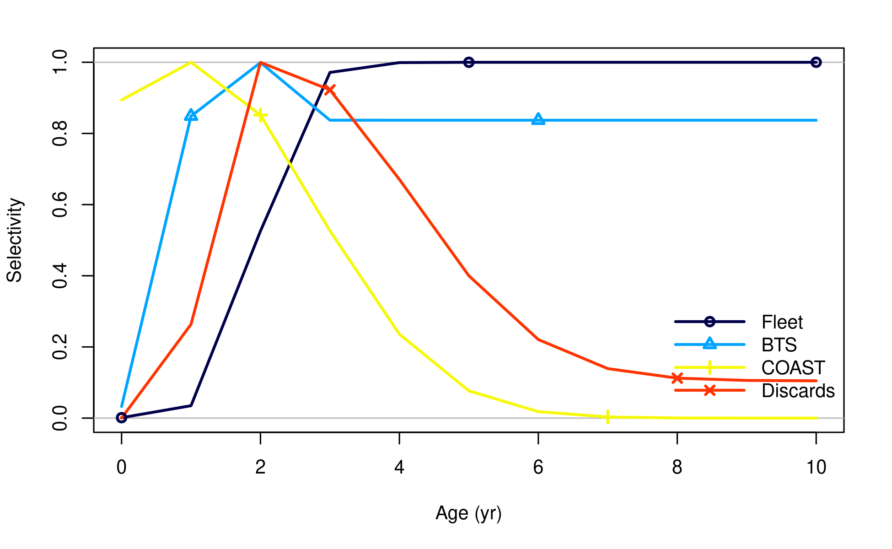
```
:::
::::

## Landings selectivity

:::: {.columns}
::: {.column width="50%"}
- WGNSSK
```{r, out.width="100%"}
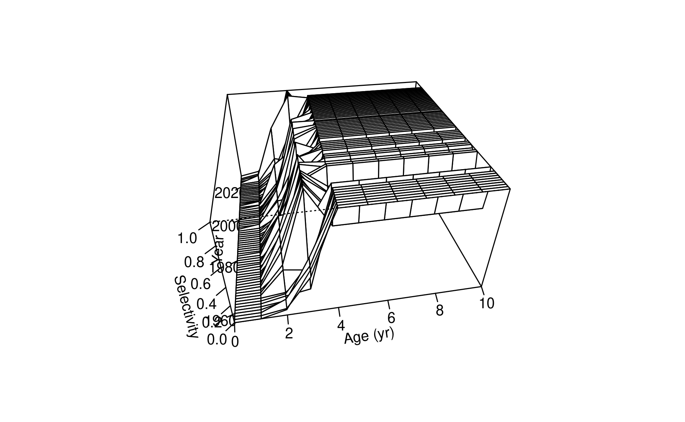
```
:::
::: {.column width="50%"}
- SELEX
```{r, out.width="100%"}
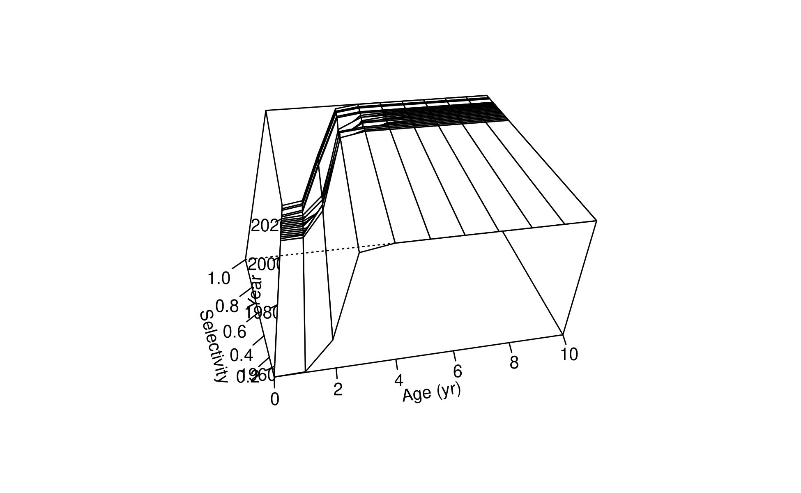
```
:::
::::

## Fit to BTS

:::: {.columns}
::: {.column width="50%"}
- WGNSSK
```{r, out.width="100%"}
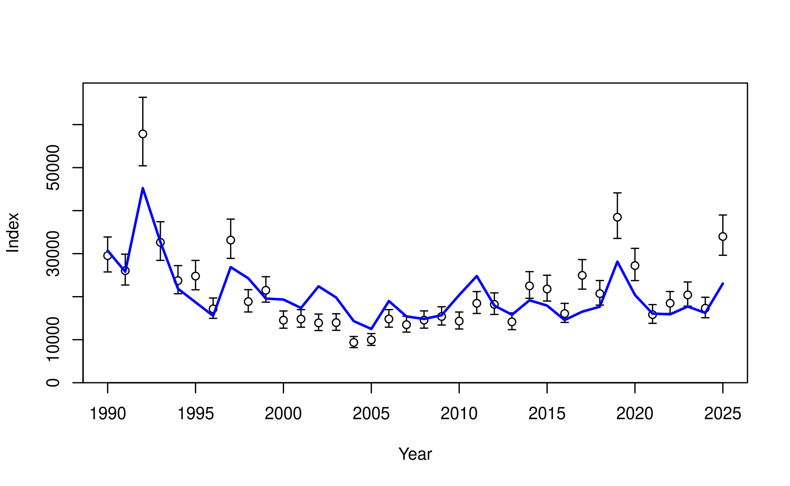
```
:::
::: {.column width="50%"}
- SELEX
```{r, out.width="100%"}
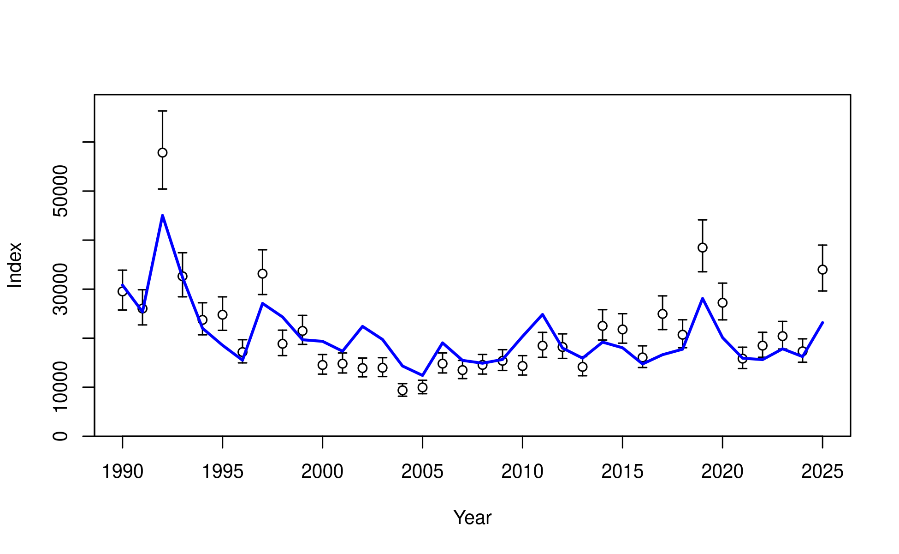
```
:::
::::

## Prediction skill

```{r, out.width="45%", fig.show='hold'}
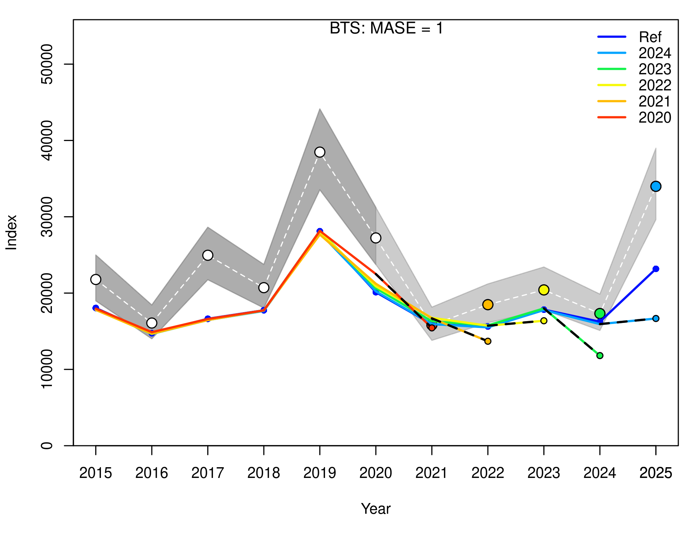
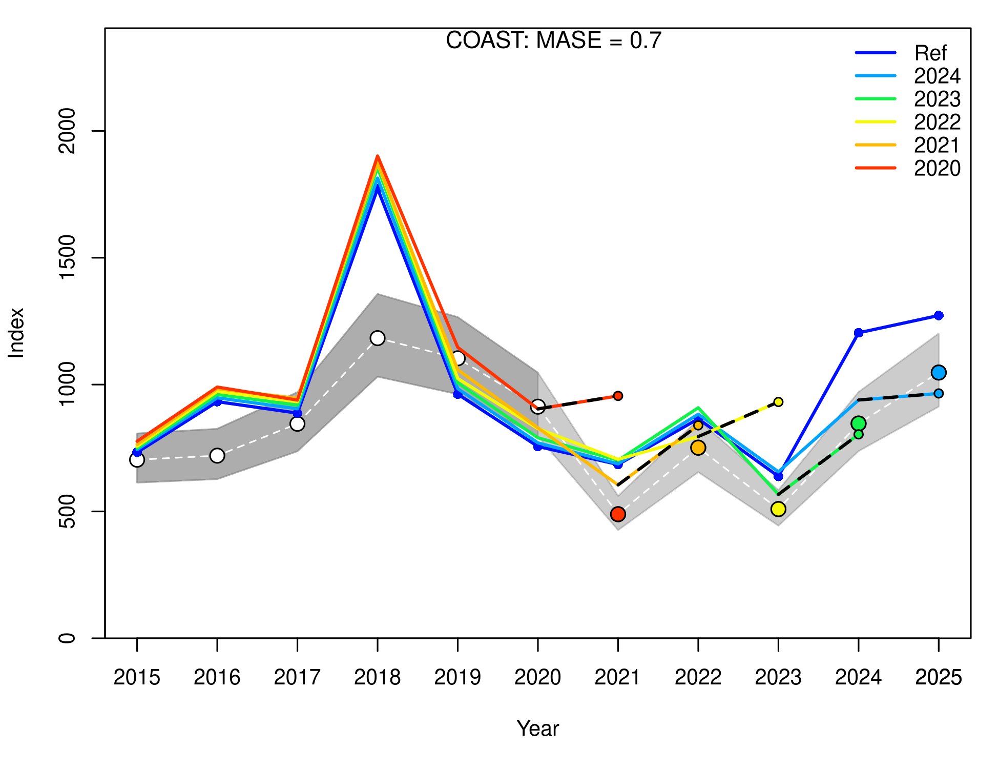
```

## Retrospective patterns

```{r}
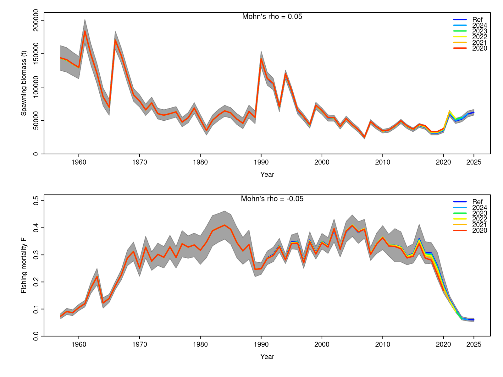
```

## Residuals

:::: {.columns}
::: {.column width="50%"}
- WGNSSK
```{r, out.width="80%"}
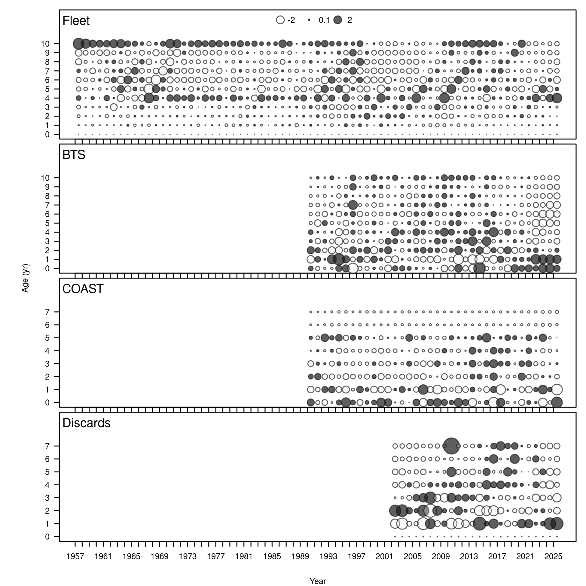
```
:::
::: {.column width="50%"}
- SELEX
```{r, out.width="80%"}
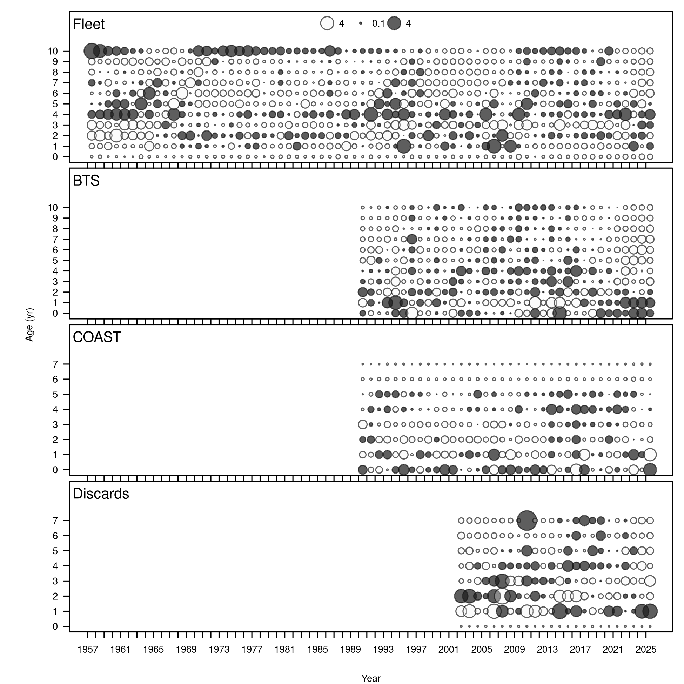
```
:::
::::

## Setup

\tiny

```
| # LO | HI | INIT | PRIOR | PR_SD | PR_type | PHASE | env-var | use_dev | dev_mnyr | dev_mxyr | dev_PH | Block | Blk_Fxn | parm_name |  |
|---|---|---|---|---|---|---|---|---|---|---|---|---|---|---|---|
| # 1 |  |  | Fleet | AgeSelex |  |  |  |  |  |  |  |  |  |  |  |
| 0 | 20 | 2.23076 | 10 | 4 | 0.5 | 5 | 0 | 23 | 2009 | 2021 | 5 | 0 | 0 | Age_inflection_Fleet(1) |  |
| -4 | 30 | 0.710311 | 1 | 4 | 0.5 | 6 | 0 | 23 | 2009 | 2021 | 6 | 0 | 0 | Age_95%width_Fleet(1) |  |
| # 2 |  |  | BTS | AgeSelex |  |  |  |  |  |  |  |  |  |  |  |
| 0 | 9.9 | 1.2036 | 2 | 1 | 0.05 | 4 | 0 | 0 | 0 | 0 | 0.5 | 0 | 0 | Age_DblN_peak_BTS(2) |  |
| -5 | 3 | -3.79741 | -5 | 1 | 0.05 | 4 | 0 | 0 | 0 | 0 | 0.5 | 0 | 0 | Age_DblN_top_logit_BTS(2) |  |
| -4 | 12 | -1.44672 | 8.4 | 1 | 0.05 | 4 | 0 | 0 | 0 | 0 | 0.5 | 0 | 0 | Age_DblN_ascend_se_BTS(2) |  |
| -10 | 6 | -3.47201 | 3 | 1 | 0.05 | -4 | 0 | 0 | 0 | 0 | 0.5 | 0 | 0 | Age_DblN_descend_se_BTS(2) |  |
| -15 | 5 | -3.38987 | 0 | 1 | 0.05 | -4 | 0 | 0 | 0 | 0 | 0.5 | 0 | 0 | Age_DblN_start_logit_BTS(2) |  |
| -5 | 15 | 1.63717 | 0.9 | 1 | 0.05 | -4 | 0 | 0 | 0 | 0 | 0.5 | 0 | 0 | Age_DblN_end_logit_BTS(2) |  |
| # 3 | COAST | AgeSelex |  |  |  |  |  |  |  |  |  |  |  |  |  |
| 0 | 9.9 | 4.32E-05 | 2 | 1 | 0.05 | -4 | 0 | 0 | 0 | 0 | 0.5 | 0 | 0 | Age_DblN_peak_COAST(3) |  |
| -15 | 3 | -12.5387 | -5 | 1 | 0.05 | 4 | 0 | 0 | 0 | 0 | 0.5 | 0 | 0 | Age_DblN_top_logit_COAST(3) |  |
| -30 | 12 | -20.9735 | 5.9 | 1 | 0.05 | 4 | 0 | 0 | 0 | 0 | 0.5 | 0 | 0 | Age_DblN_ascend_se_COAST(3) |  |
| -2 | 6 | 1.82926 | 0.3 | 1 | 0.05 | 4 | 0 | 0 | 0 | 0 | 0.5 | 0 | 0 | Age_DblN_descend_se_COAST(3) |  |
| -15 | 5 | 1.31219 | 0.8 | 1 | 0.05 | 4 | 0 | 0 | 0 | 0 | 0.5 | 0 | 0 | Age_DblN_start_logit_COAST(3) |  |
| -15 | 5 | -11.8416 | 0 | 1 | 0.05 | 4 | 0 | 0 | 0 | 0 | 0.5 | 0 | 0 | Age_DblN_end_logit_COAST(3) |  |
| # 4 | Discards | AgeSelex |  |  |  |  |  |  |  |  |  |  |  |  |  |
| 0 | 9.9 | 1.19921 | 2 | 1 | 0.05 | 4 | 0 | 0 | 0 | 0 | 0.5 | 0 | 0 | Age_DblN_peak_Discards(4) |  |
| -15 | 3 | -10.277 | -5 | 1 | 0.05 | 4 | 0 | 0 | 0 | 0 | 0.5 | 0 | 0 | Age_DblN_top_logit_Discards(4) |  |
| -4 | 12 | -3.59095 | 0.3 | 1 | 0.05 | 4 | 0 | 0 | 0 | 0 | 0.5 | 0 | 0 | Age_DblN_ascend_se_Discards(4) |  |
| -2 | 6 | 1.956 | 1 | 1 | 0.05 | 4 | 0 | 0 | 0 | 0 | 0.5 | 0 | 0 | Age_DblN_descend_se_Discards(4) |  |
| -15 | 5 | -14.6525 | 0 | 1 | 0.05 | 4 | 0 | 0 | 0 | 0 | 0.5 | 0 | 0 | Age_DblN_start_logit_Discards(4) |  |
| -5 | 5 | -2.14541 | 0.2 | 1 | 0.05 | 4 | 0 | 0 | 0 | 0 | 0.5 | 0 | 0 | Age_DblN_end_logit_Discards(4) |  |
```

## Estimated parameters

\tiny

:::: {.columns}
::: {.column width="50%"}
- WGNSSK
```{r}
load('model/ss3/tables/table_parcounts.rda', verbose=FALSE)
kable(subset(table_parcounts$table, Count > 0))
```
:::
::: {.column width="50%"}
- SELEX
```{r}
load('model/selex/tables/table_parcounts.rda', verbose=FALSE)
kable(subset(table_parcounts$table, Count > 0))
```
:::
::::

## Summary

- Proposed less flexible selectivity setup
- Fewer parameters, more stable estimates
- Fit not dramatically altered
- Are recent fishery changes in need of another block?
- What is happening with BTS?

