```{r, knitr, echo=FALSE, message=FALSE}
library(knitr)
opts_chunk$set(echo=FALSE, message=FALSE, warning=FALSE,
  out.width="55%", fig.pos='htb', fig.align="center")
library(mgcv)
```

# Introduction

Changes in the computed stock mean weights-at-age for North sea sole in recent years have raised issues about their precision and potential effect in the estimation of final year stock status. As representative surveys for this stock are conducted later than the spawning season, the mean weights-at-age for the stock are computed from the catch, landings and discards combined, in the second quarter of the year.

We have investigated the potential impact of these changes in the stock assessment and forecast. A series of Generalized Additive Models (GAMs) have been fitted to the time series of mean weights-at-age that include year and cohort effects, and their predictions have been used in alternative runs of the stock assessment model. The results of these runs have been compared with the base case run [@ICES_2025_WGNSSK] to evaluate the impact of the changes in weights-at-age on the estimation of stock status and advice.

# Material and Methods

## Stock weights-at-age dataset

Weights-at-age in the stock for North sea sole are constructed from the mean values in the catch, landings and discards combined, in the second quarter of the year. Their values for the period 1967-2024 are presented in Figure \@ref(fig:stockweightatage), with a loess smoother showing their long term trends. Values and trends for the more recent period (2010-2024) are shown in Figure \@ref(fig:stockweightatage2010).

```{r stockweightatage, fig.cap="Weights-at-age in the stock for North sea sole, 1967-2024. Lines are computed as a loess smoother by age."}
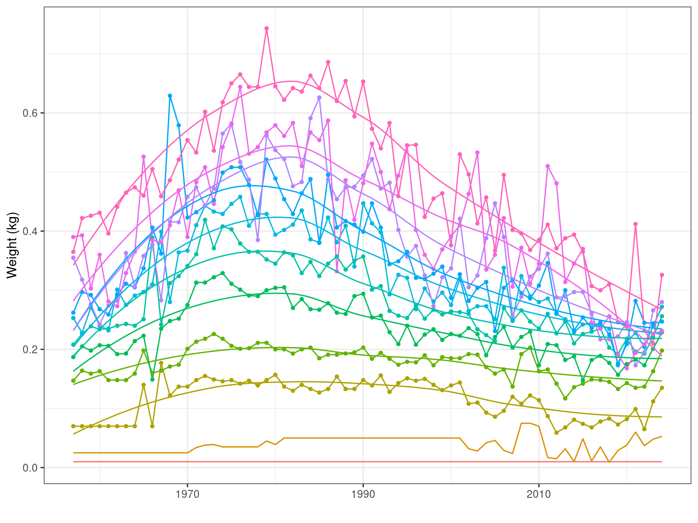
```

```{r, stockweightatage2010, fig.cap="Weights-at-age in the stock for North sea sole, 2010-2024. Lines are computed as a loess smoother by age."}
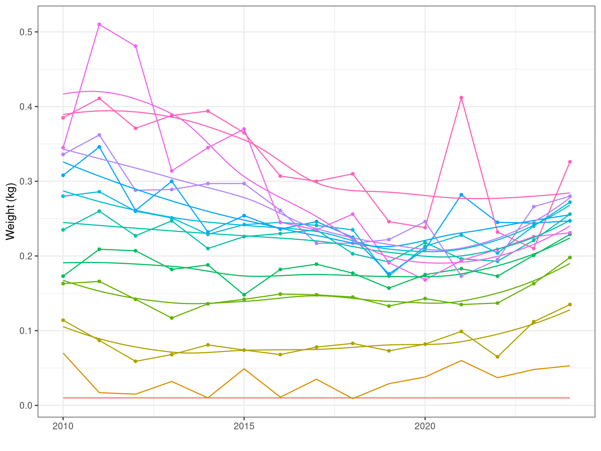
```

Weights-at-age along the the 2004 to 2021 cohorts are presented in Figure \@ref(fig:cohortweightatage). Larger dots represent the mature ages. The 2021 cohort appears to have experienced two years of faster growth, with age 3 individuals almost reaching the mean weight of those of age 4 in the previous cohort, that of 2020, which itself has grown faster than previous ones.

```{r cohortweightatage, fig.cap="Weights-at-age for North Sea sole for the 2004 to 2021 cohorts."}
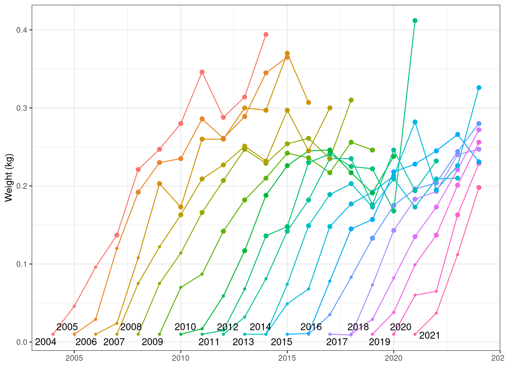
```

Yearly changes in mean weights-at-age over the last few years have been responsible for a good part of the changes in spawning stock biomass, as shown below. The values for ages 3 to 5, that form a large proportion of the reproductive part of this stock (Figure \@ref(fig:modelpropssb)), have a particular impact. Large changes can also affect disproportionally the average weights used in the short-term forecast from which advice is generated. although a five-year average is currently used to minimize this effect. The annual percentual change in the weights-at-age for the 2010-2024 period is shown in Figure \@ref(fig:stockweightatagechange). Although some changes appear to be consistent across a number of years (e.g. 2022-2003), maybe indicating favourable conditions, some other changes are more erratic, indicating that sampling error might also be important, specially for the older ages.

```{r modelpropssb, fig.cap="Proportion of the spawning stock biomass (SSB) at age for North Sea sole, 1967-2024."}
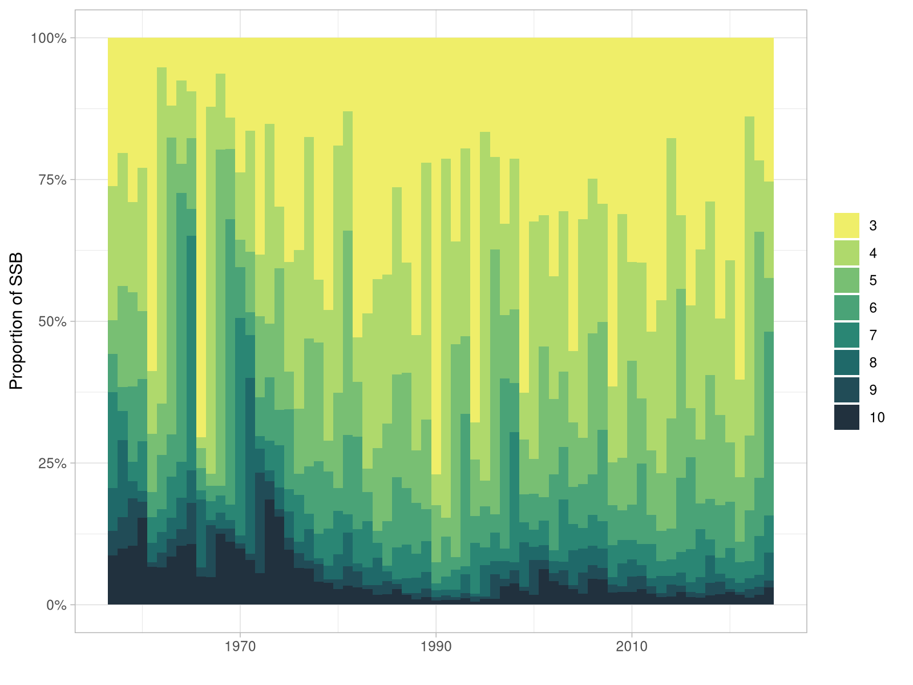
```

```{r stockweightatagechange, fig.cap="Yearly percentual change in weights-at-age for North Sea sole for the 2010-2024 period."}
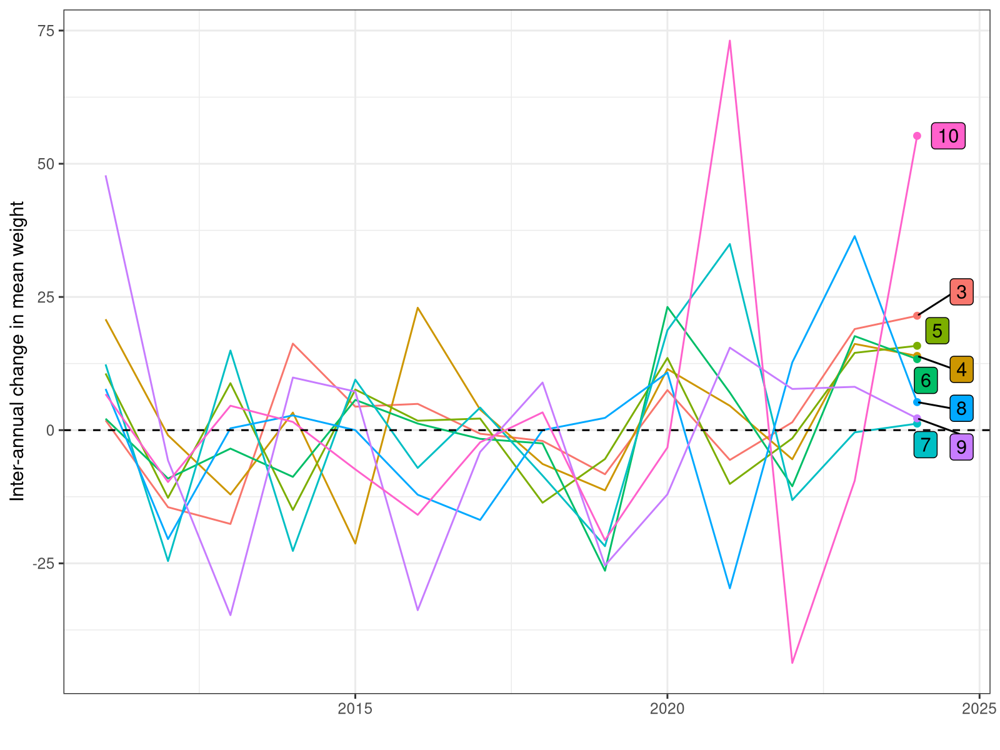
```

## Model formulations

- [@Thorson_2016_relativemagnitude] explored models across range of stocks, suggested most parsimonious

- GAM: `weight ~ as.factor(age) + s(year, by = as.factor(age), k = 10)`
  - Explored number of knots to evaluate sensitivity: 10, 15, 20
- TE: `weight ~ te(age, year, k = c(9, 15))`
- TI: `weight ~ s(age) + s(year, k=15) + ti(age, year, k = c(9, 15))`

## Setup of alternative model runs

- TODO: RUNNING mean

- Run using 2023 wtatage to assess change in SSB due to wtatage
- wtatage.ss modified to include predictions of weights-at-age from the 
- Values modified for weights-at-age in the stock, both at the start and middle (fleets 0 and -1), survey fleets (2 and 3), and maturity ogive (fleet -2).
- SS3 was fit across all wtatage sets
- Retros run
- STF run with two models: GAM with 15 knots, and TE with te().

# Results

```{r loadmodel}
load("model/model.rda")
```
  
## Age-specific smooth of year

- Values almost equal with increasing number of knots, except for age 1

```{r gampredictionsbyage, fig.cap="Predicted weights-at-age over time from the three GAM models with an age-specific smooth of year and varying numbers of knots: 10, 15 and 20. Dots show the original values."}
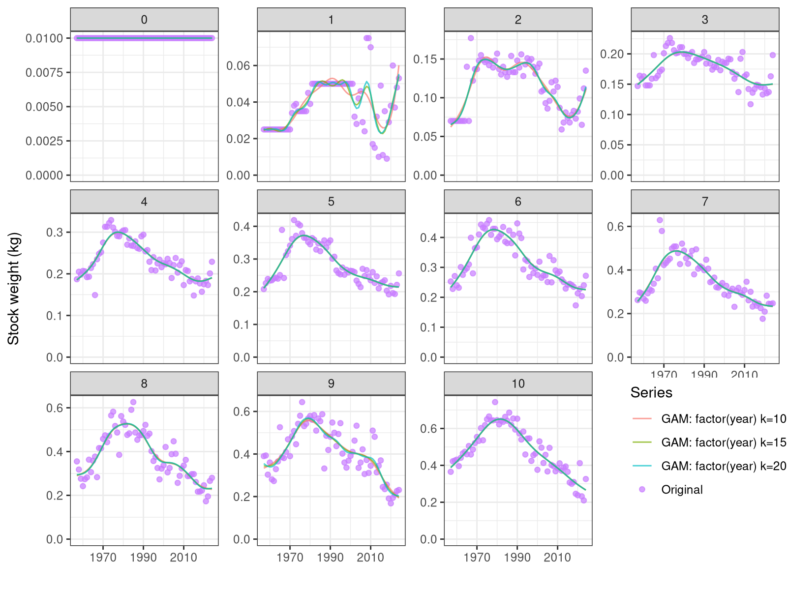
```

## te(), ti()

```{r checkte, fig.cap="Diagnostic plots for the GAM model with a tensor product smoother over age and year.", out.width="80%", results="hide"}
gam.check(mods$TE)
```

```{r checkti, fig.cap="Diagnostic plots for the GAM model with a tensor product interaction smoother over age and year.", out.width="80%", results="hide"}
gam.check(mods$TI)
```


```{r gampredictionsbyageteti, fig.cap="Predicted weights-at-age over time from the two GAM models consiodering year and age interactions. Dots show the original values."}
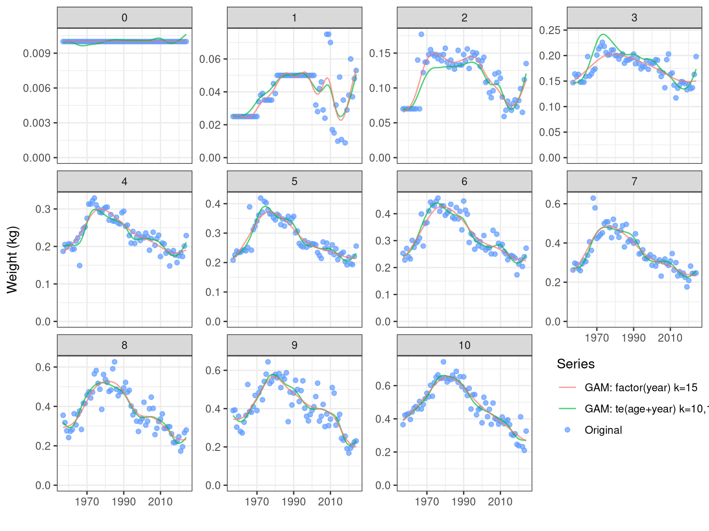
```

## Model comparison

- AIC & BIC

```{r modelbics}
foo <- function(x) {
  paste(as.character(formula(x))[c(2,1,3)], collapse=" ")
}

kable(cbind(
  Model=unlist(lapply(mods, foo)),
  AIC(mods$GAM10, mods$GAM15, mods$GAM20, mods$TE, mods$TI),
  BIC(mods$GAM10, mods$GAM15, mods$GAM20, mods$TE, mods$TI))[, c(1, 2, 3, 5)],
  caption="AIC and BIC values for all tested models.", label="modelbics")
```

## Effect in stock assessment

```{r, fig.cap="Time series of SSB, "}
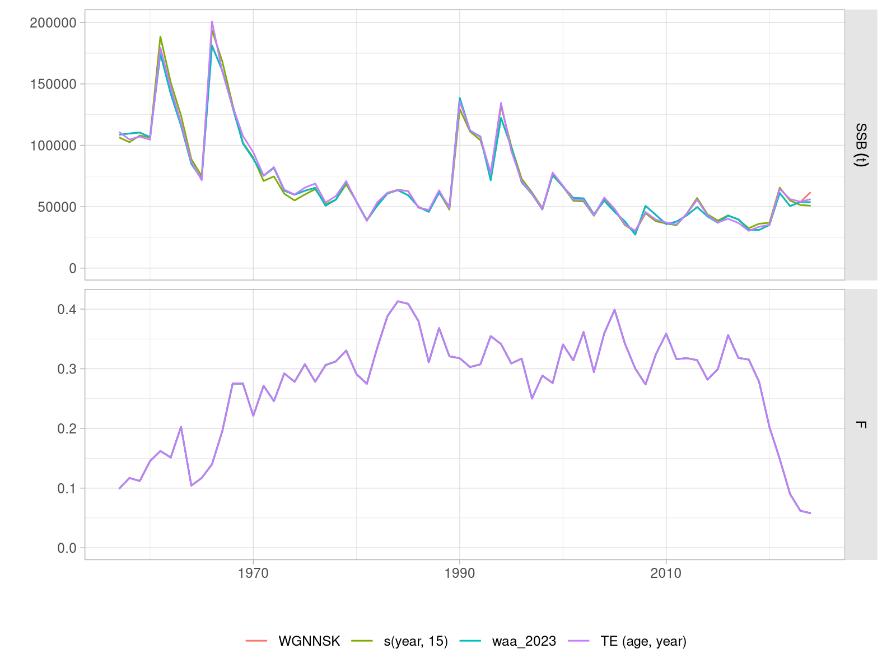
```

```{r, fig.cap=""}
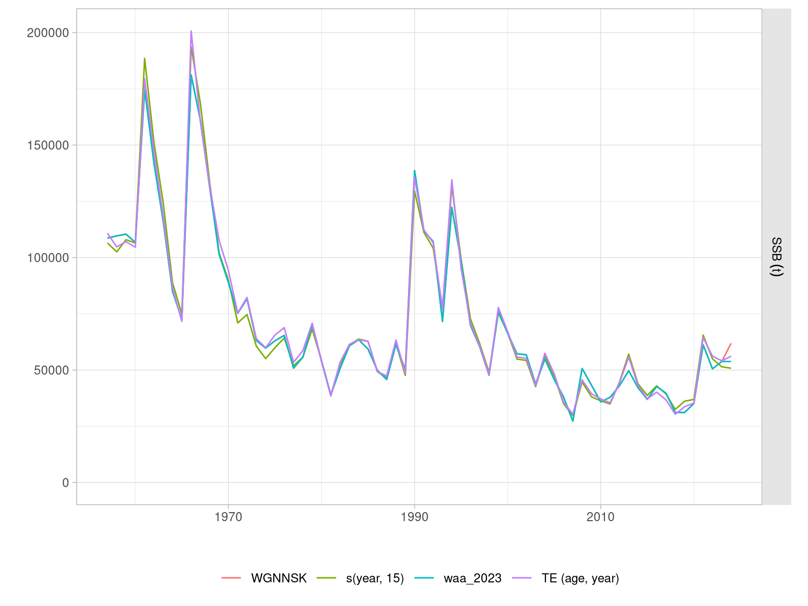
```


```{r ss3-logcpuefitBTS, fig.cap="Fit to the BTS index of abundance for the SS3 runs using weights-at-age modelled using the GAM model an 15 knots (top) and age and year tensor spline (bottom).", fig.show = "hold"}
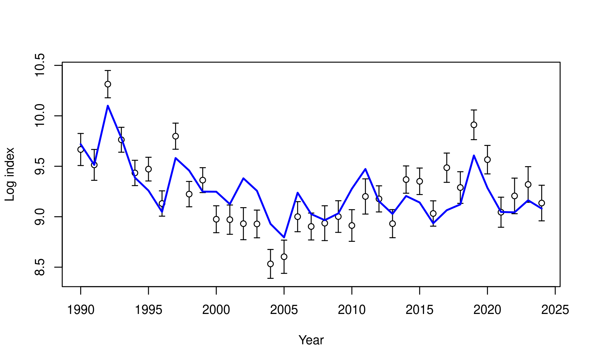

```


```{r ss3-logcpuefitCOAST, fig.cap="Fit to the COAST index of abundance for the SS3 runs using weights-at-age modelled using the GAM model an 15 knots (top) and age and year tensor spline (bottom).", fig.show = "hold"}

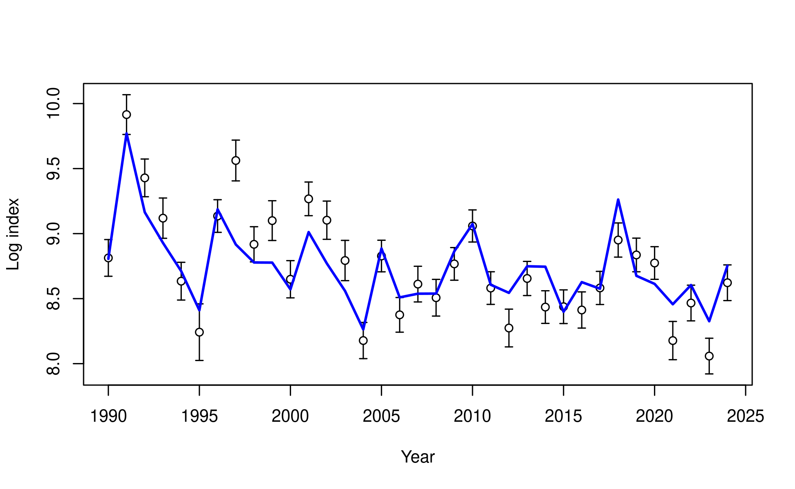
```

### Retrospective patterns

The usual five-year retrospective analysis was run for two of the models: GAM with 15 knots, and TE with te(). Ecah run in the analysis involved the selection of a time series trimmed by one to five years, refitting of the weights-at-age model with the subset data, and run of the stock assessment with the newly predicted weights-at-age. The retrospective patterns for SSB are shown in Figure \@ref(fig:retrospectivecomparison).

```{r retrospectivecomparison, fig.cap="Retrospective patterns for SSB for the base case WGNSSK 2025 run (top) and two models: GAM with 15 knots (middle), and TE with te() (bopttom).", out.width="90%"}
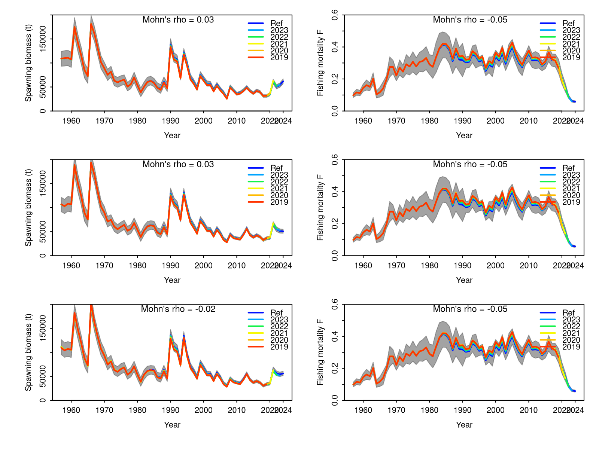
```

The Mohn's rho value for spawning biomass is lower for the assessment model run using the TE weights-at-age predictions (Figure \@ref(retrospectivecomparison), bottom left), indicating a lower retrospective bias.

# Discussion

- Growth in last 2 years across most ages, while cahnges in older ages likely due to sampling

- Model `TE` provides similar predictions to `GAM`, but with more flexibility in the age-year interactions. AIC and BIC are similar

### Stock weights-at-age averages for forecast

Large changes in mean weights-at-age on the final year can affect the value employed in the short term forecast for advice. For this stock, a five-year average is used. This average was recomputed for two of the weight-at-age models (GAM and TE) over the fievb-year retrospective runs. The stability of the weights-at-age averages for the short-term forecast are shown in Figure \@ref(fig:stockweightsaverages).

```{r stockweightsaverages, fig.cap="Three-year averages of weights-at-age for the stock, used in the short-term forecast for advice. Years in bottom axis are the last year of the average (i.e. 2024 for the 2022-2024 average)." }
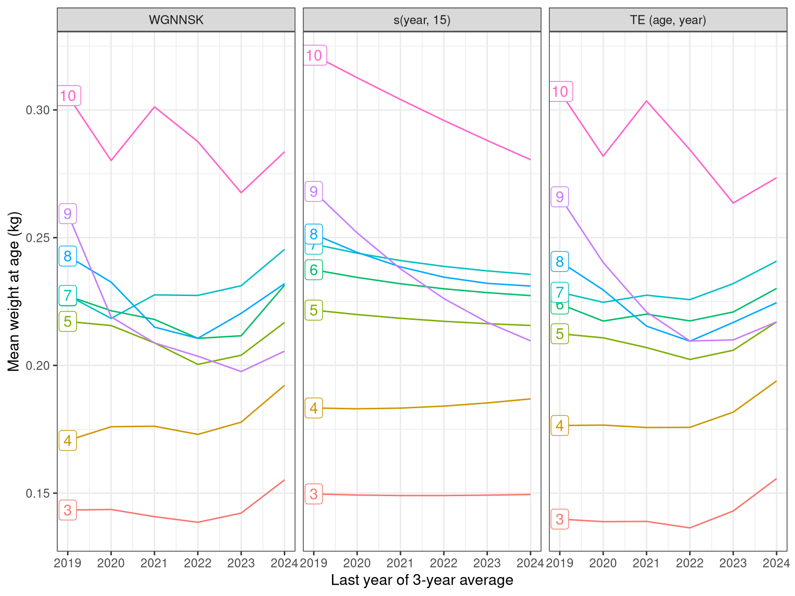
```

# References

